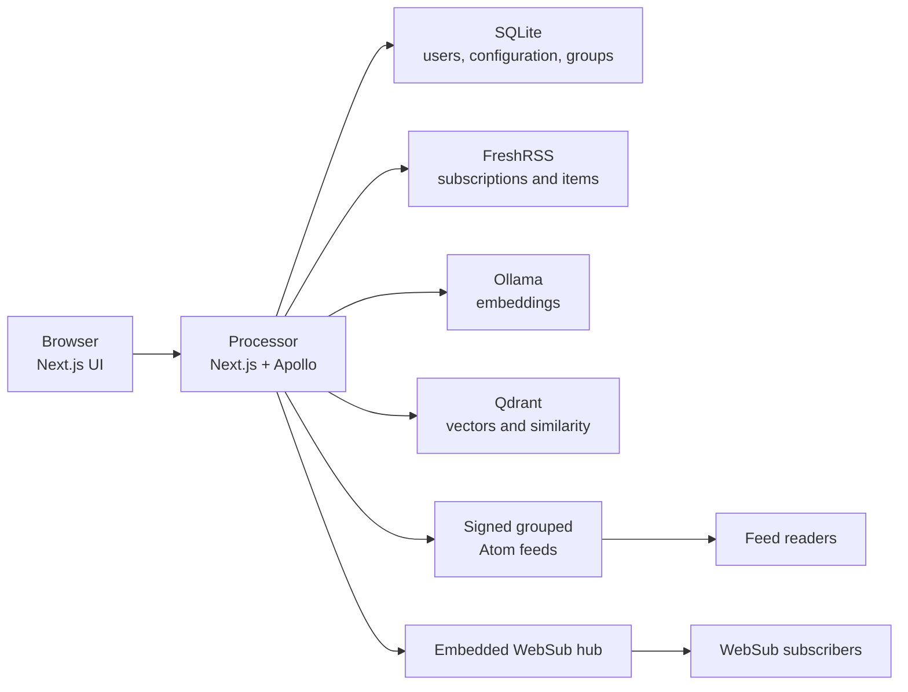

Processor is a self-hosted Next.js application that coordinates RSS synchronization, semantic embeddings, vector search, grouping, Atom publication, and WebSub delivery. The browser talks to the application; the application owns all credentials and integrations.

## Application layer

Next.js 16 App Router renders locale-prefixed React 19 pages and exposes route handlers. Apollo Server serves a composed GraphQL schema at `/api/graphql`; Apollo Client uses generated typed operations. NextAuth establishes sessions and the GraphQL `@auth` directive enforces role requirements at resolver boundaries.

## Data ownership

- **FreshRSS** remains the source of subscriptions, categories, article content, tags, and read state.
- **SQLite through Prisma** stores users, local service configuration, folder processing policy, source priorities, article groups, similarity history, and WebSub work queues.
- **Qdrant** stores embeddings and provides nearest-neighbor lookup.
- **Ollama** is compute, not authoritative storage; it generates vectors for the configured model.

## Deployment boundary

The `processor` container can run independently from FreshRSS, Ollama, and Qdrant, provided their endpoints are reachable. Keep secrets on the server side and expose only the Next.js HTTP port through the reverse proxy.

## Compatibility boundary

The product is named **Processor**, while intentionally stable RSS-domain interfaces retain names such as `RSS_PROCESSOR_*`, `/rss-processor-status`, and `/api/rss-processor/debug`. Those identifiers are configuration and API contracts, not public branding.

## Reliability model

Processing commits incrementally across external systems. A failed run can leave already-completed synchronization, vectors, or group changes intact. Retrying must therefore be safe and operators should use status events to locate the failed phase rather than assuming transaction-wide rollback.
