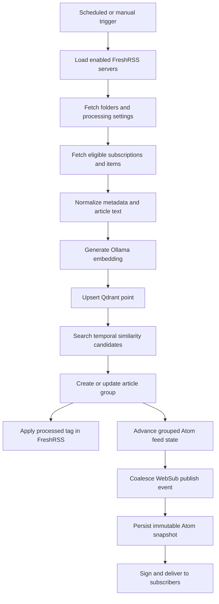

## 1. Trigger and configuration

Runs start from the status page or the configured interval. Processor loads enabled servers and folder policies, then establishes an SSE timeline for interactive runs.

## 2. Synchronization and eligibility

Processor retrieves FreshRSS categories, subscriptions, and bounded item batches. Folder processing state, item age, retry limits, and prior processed tags determine eligibility. Processing delay can intentionally hold recent items so overlapping coverage has time to arrive.

## 3. Normalization and embedding

Title and body content are normalized and capped by `RSS_PROCESSOR_MAX_CONTENT_LENGTH`. Title influence is controlled by `RSS_PROCESSOR_TITLE_WEIGHT`. Ollama returns a vector whose dimension must match the configured Qdrant collection.

## 4. Vector storage and grouping

The point is stored in Qdrant and compared with candidates inside the folder, server, time, and lookback boundaries. Scores at or above the threshold can join a group. Relational group membership and durable similarity statistics are then updated.

## 5. Upstream acknowledgement

After successful vector processing, Processor applies the configured FreshRSS processed tag. Tag failure is retryable and should not be confused with an embedding failure.

## 6. Publication

Group mutations advance a monotonic feed timestamp. Signed Atom endpoints render current group state. When WebSub is enabled, a durable outbox coalesces changes, persists an immutable publication body, and creates retryable subscriber deliveries.

## Cancellation and retry

Cancellation is cooperative. Work already committed remains valid, and a later incremental run resumes from durable state. Retry counts and delays exist separately for feed/subscription work and document work so a single bad item does not immediately terminate the entire server run.
